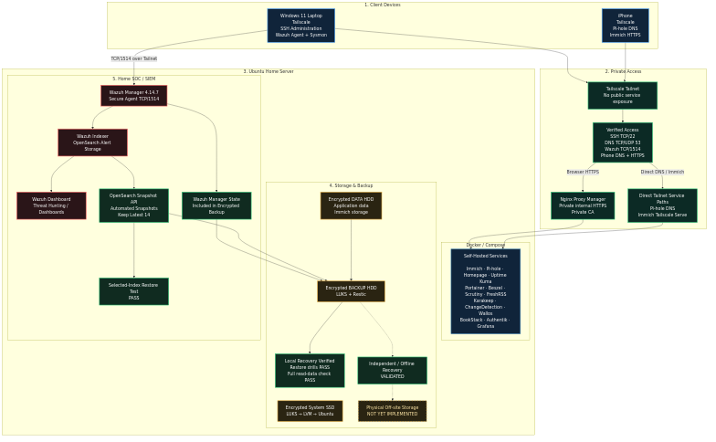
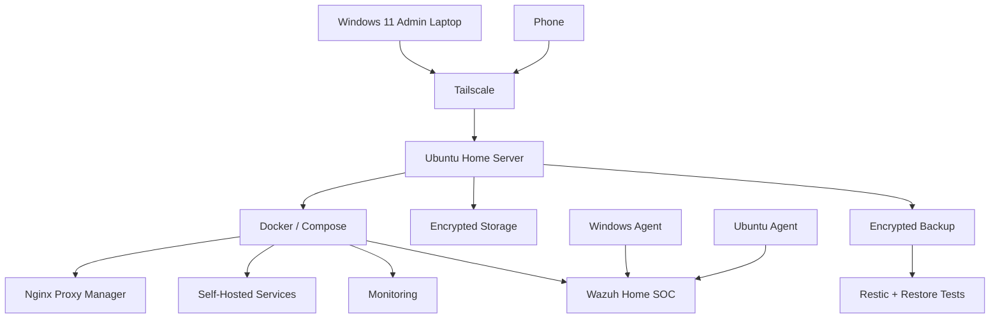
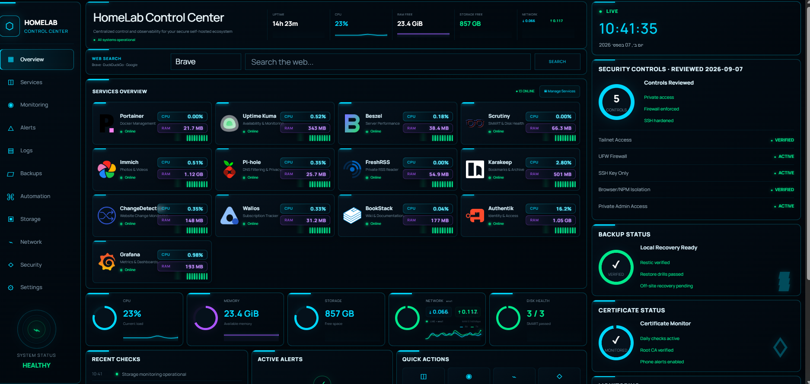
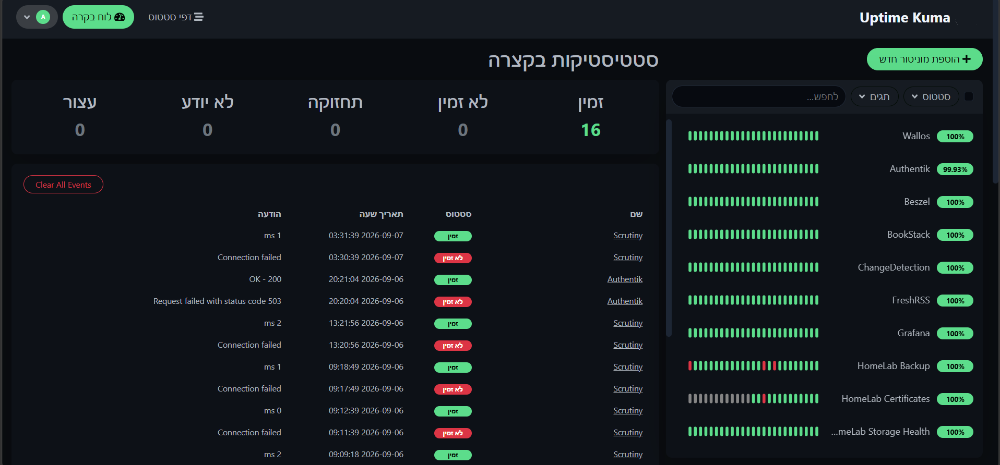
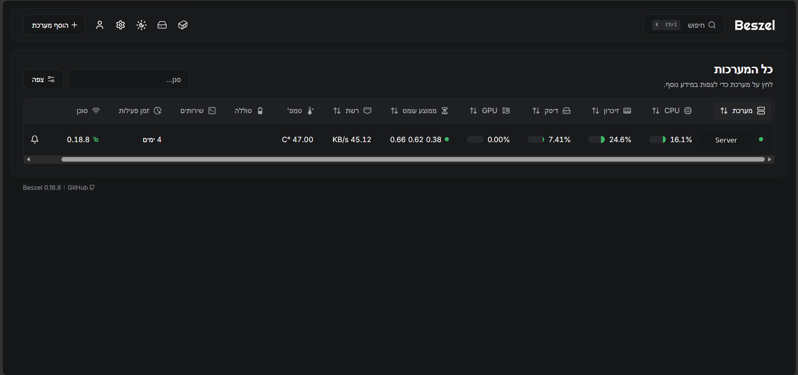
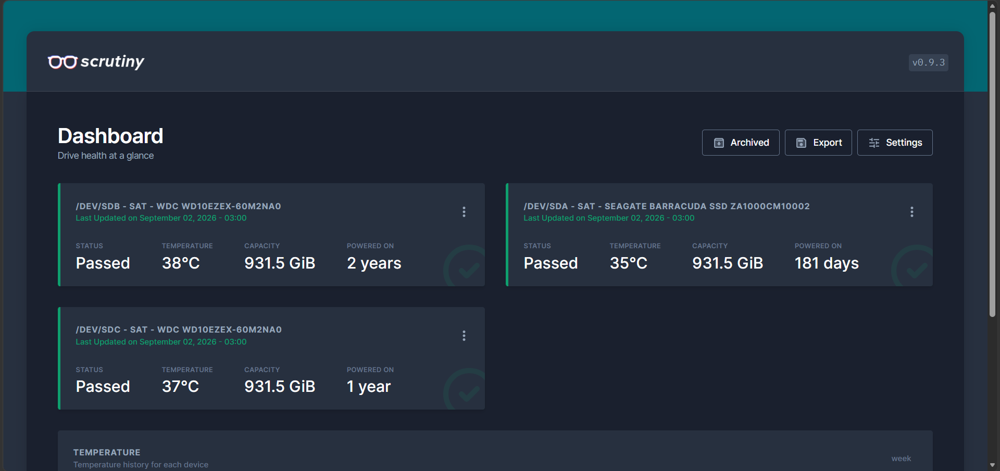
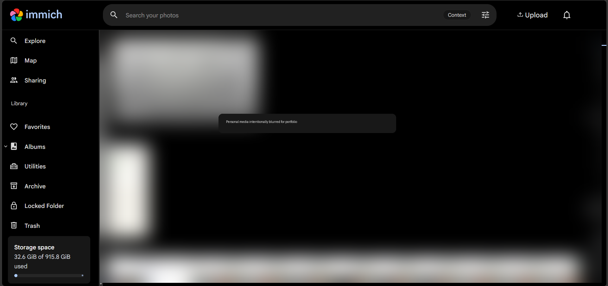

# HomeLab Infrastructure & Security

A practical HomeLab project demonstrating Linux administration, Docker, networking, security hardening, monitoring, backup/recovery, and SOC/SIEM operations.

The project started as a virtual lab and evolved into a 24/7 Ubuntu home server with self-hosted services and a dedicated Wazuh Home SOC.

> Public documentation is sanitized. Secrets, private keys, credentials, internal addresses, live configuration files, and backup data are not published.

## Project Story

```text
Virtual Lab
    ↓
Ubuntu Home Server
    ↓
Docker Infrastructure
    ↓
Self-Hosted Services
    ↓
Security + HTTPS + Remote Access
    ↓
Monitoring
    ↓
Encrypted Backup + Recovery
    ↓
Home SOC / SIEM
```

## Architecture





## Main Areas

- Ubuntu Server administration
- Docker and Docker Compose
- Reverse proxy and internal HTTPS
- Tailscale private access
- Self-hosted applications
- Monitoring and observability
- LUKS encrypted storage
- Restic backups and restore validation
- Wazuh + Sysmon Home SOC
- Custom detections, MITRE ATT&CK and Threat Hunting

## Self-Hosted Services

Immich, Pi-hole, Nginx Proxy Manager, Homepage, Uptime Kuma, Portainer, Beszel, Scrutiny, FreshRSS, Karakeep, ChangeDetection, Wallos, BookStack, Authentik and Grafana.

## Home SOC

The HomeLab was later extended with Wazuh, Windows and Ubuntu agents, Sysmon, custom detections, MITRE ATT&CK mapping, false-positive tuning, Threat Hunting, incident documentation, retention and backup validation.

Detailed SOC repository:

**https://github.com/nick1-creator/HomeLab-SOC**

## Skills Demonstrated

| Area | Skills |
|---|---|
| Linux | Ubuntu, systemd, permissions, storage, logs |
| Containers | Docker, Compose, container networking |
| Networking | DNS, reverse proxy, private networking, Tailscale |
| Security | LUKS, TLS, Private CA, access control |
| Monitoring | Uptime Kuma, Beszel, Scrutiny, Grafana |
| Backup | Restic, retention, automation, restore testing |
| SOC / SIEM | Wazuh, Sysmon, Threat Hunting |
| Detection | Custom rules, tuning, MITRE ATT&CK |
| Documentation | Architecture, recovery, incident reports |

## Interview Summary

> I built a HomeLab that started as a virtual lab and evolved into a 24/7 Ubuntu home server. I deployed Docker-based services, secured remote access, implemented HTTPS and encrypted storage, added monitoring and automated backups with restore testing, and later extended the environment with a Wazuh-based Home SOC for endpoint monitoring, custom detections, Threat Hunting, and incident investigation.


## Project Screenshots

### HomeLab Control Center
Central dashboard showing the main self-hosted services, system health, security status and backup status.



### Service Monitoring
Uptime Kuma monitors the availability of the HomeLab services.



### Server Monitoring
Beszel provides server and resource monitoring.



### Disk Health
Scrutiny monitors SMART status, temperature and health of the physical drives.



### Private Photo Management
Immich provides private photo and video management. Personal media is intentionally blurred in the portfolio screenshot.



## Incident Investigation

A real operational backup incident was investigated using SSH logs, Auditd, Wazuh, firewall logs, Docker inspection and Windows telemetry.

The investigation attributed the stale Restic repository lock with high confidence to authorized manual maintenance activity, with **no evidence of compromise**.

Detailed report:

[Restic Stale Repository Lock Incident](docs/10-restic-stale-lock-incident.md)

## Status

**HomeLab Infrastructure & Security v1 — COMPLETE.**

Final operational validation completed on **2026-09-10** after two consecutive successful scheduled backups using the hardened Wazuh backup flow and a clean final health check.

Continued operational evidence through **2026-09-18** shows successful daily scheduled HomeLab backup notifications on every date from **2026-09-06 through 2026-09-18**. The latest confirmed success was **2026-09-18 03:31:56 IDT**.

The detailed Wazuh quiesce, Indexer snapshot and recovery validation remains based on the deeper 2026-09-09 and 2026-09-10 checks documented in the recovery material.

The environment is now in normal maintenance mode.

Documented residual limitations:

- the validated USB recovery copy is independent/offline but stored in the same home, so it is not physically off-site
- F03/F04 post-reboot runtime persistence remains to be validated during a future planned reboot
- Secure Boot dbx/KEK maintenance is deferred to a controlled physical maintenance window
